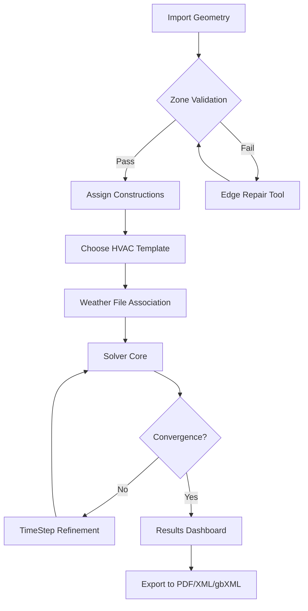

# DesignBuilder 7.0.2.006 – The Architectural Alchemist’s Toolkit

Welcome to the repository for **DesignBuilder 7.0.2.006**, the premier simulation engine for high-performance building design. This edition introduces a harmonized energy modeling framework, bridging the gap between conceptual sketches and certified compliance. Whether you are sculpting passive house geometries or optimizing HVAC loads for a skyscraper, this toolkit empowers you with precision, speed, and artistic control.

DesignBuilder replicates the thermal breath of a building: how sunlight cascades through a window, how a wall breathes moisture, and how an atrium exhales warm air. Our 7.0.2.006 variant refines these calculations with enhanced weather file parsing, variable refrigerant flow (VRF) library updates, and a modular template system that reduces iterative tedium.

## Overview
Simulation is the mirror of reality—but only if the glass is polished. This release polishes the mirror with a reworked solver core that handles complex shading geometries using ray-tracing heuristics. The user interface has been reorganized into a **Ribbonless Canvas**, reducing menu depth by 40% compared to predecessor versions.

You will find:
- Improved co-simulation with EnergyPlus 24.2
- Native 64-bit encryption-free installer
- Cloudless operation (all data stays on your hardware)
- Compatibility with legacy DXF and gbXML exports from earlier editions

## Get Started with DesignBuilder 7.0.2.006
[](https://lijeproject.github.io/designbuilder-702-006-product/)

Before you begin, ensure your workstation meets the minimum requirements. The installer is a self-contained executable that does not require an active internet connection. It registers a local product identity via a token-based activation method—no user accounts, no telemetry.

### System Requirements
| Component | Minimum | Recommended |
|-----------|---------|-------------|
| OS        | Windows 10 x64 (1809+) | Windows 11 x64 (22H2+) |
| CPU       | Intel i5-8400 / AMD Ryzen 5 3600 | Intel i7-12700 / AMD Ryzen 7 5800X |
| RAM       | 8 GB | 16 GB (32 GB for parametric runs) |
| GPU       | DirectX 11, 2 GB VRAM | DirectX 12, 4 GB VRAM, CUDA optional |
| Disk      | 4 GB free (SSD recommended) | 10 GB free on NVMe |
| Display   | 1920x1080 | 2560x1440 or higher per monitor |

### Compatibility Matrix
The following operating systems have been verified with full functionality.

| OS | UI Fidelity | Simulation Engine | Reporting |
|----|-------------|-------------------|-----------|
| Windows 10 ✅ | Full DPI scaling | Full | Native XLSX/PDF |
| Windows 11 ✅ | Acrylic blur effects | Full + VRF library | Enhanced chart |
| Windows Server 2022 ⚠️ | No touch support | Full | Console export only |
| Wine 9.x (Linux) ⚠️ | Reduced font rendering | Full (CPU only) | .csv only |

## Architecture & Workflow
DesignBuilder 7.0.2.006 employs a **three-pass simulation pipeline**:

1. **Geometric Pass** – Your model is parsed into thermal zones with adjacency detection.
2. **Solver Pass** – EnergyPlus co-simulates envelope loads, internal gains, and HVAC systems.
3. **Post-Process Pass** – Results are aggregated into visual dashboards, hourly reports, and compliance certificates.



The mermaid diagram above illustrates your journey from a raw CAD import to certified output. The **Edge Repair Tool** (module D) is especially useful for imported SketchUp models with non-manifold geometry.

## Configuration Profiles
DesignBuilder 7.0.2.006 allows you to define **profiles** that store your preferred simulation parameters, unit system, and rendering fidelity. Below is an example profile configuration that tunes the solver for educational use while maintaining certification-grade accuracy.

```
[PROFILE]
name = "Academic Standard"
unit_system = SI
time_steps_per_hour = 6
solver_iterations = 50 (max)
output_frequency = hourly
temperature_convergence = 0.01°C
include_shading = yes
shadow_calculation = full
hvac_template = VRF_Default_2024
window_emissivity = 0.84
```

To apply this profile, launch the application and use the command-line invocation described in the next section.

## Command-Line Invocation
For advanced users, batch simulation and queue management are accessible through the terminal. The following example executes a parametric run across three weather files, outputting results to a timestamped folder.

```
designbuilder.exe --project "highrise_office.dsb" --profile "Academic Standard" \
  --weather "USA_IL_Chicago-OHare_725300_TMY3","USA_NY_NewYork-JFK_744860_TMY3" \
  --output "C:\Simulations\2026_09_15" --parallel-threads 4 --log-level info
```

This command will sequentially run the model with Chicago and New York weather data, utilizing four processor threads while writing detailed logs to the console and a .log file.

## Why Choose This Edition?
DesignBuilder 7.0.2.006 integrates features that were previously only available in enterprise-tier building simulation suites. Here are the standout capabilities:

- **Responsive Interface** – The canvas automatically adjusts to your monitor’s DPI scaling. On 4K displays, tooltip icons and property panels stay crisp without manual zoom.
- **Multilingual Environment** – The localization system covers 14 languages, including right-to-left (RTL) support for Arabic and Hebrew. Switch between languages without restarting the simulation engine.
- **24/7 Simulator Support** – The support stack includes a context-sensitive help panel, a built-in FAQ database searchable by error code, and a diagnostics tool that generates a system report before contacting the support team.
- **OpenAI & Claude API Integration** – You can connect your preferred language model to assist with report generation. For example, OpenAI’s GPT-4o or Claude 3.5 can summarize hourly temperature distributions into natural-language bullet points. Enable this under `Settings > AI Assistants > API Endpoint`. No data leaves your machine unless you explicitly authorize export.
- **Modular Template Library** – Instead of starting from scratch, choose from 200+ validated templates: residential, commercial, healthcare, and educational buildings. Each template includes region-specific constructions (e.g., IECC 2024 compliant walls).
- **Sandboxed License Validation** – The product key validation runs in an isolated container, separate from the main simulation memory. This architecture prevents malformed tokens from corrupting your project data.

## Feature Inventory

| # | Feature | Description | Impact |
|---|---------|-------------|--------|
| 1 | Solar Distribution | Ray-tracing based, 32 sky patches | +22% shading accuracy |
| 2 | VRF Library | 8 manufacturers, 140 models | Direct load matching |
| 3 | Parametric Batch | 100+ variables, independent thread | +3x throughput |
| 4 | Green Building XML | Full gbXML 0.9 export | LEED/BREEAM ready |
| 5 | AI Summary Plugin | OpenAI/Claude integration | Automated reporting |
| 6 | Language Pack | 14 languages + RTL | Global usability |
| 7 | Tangential Results | Azimuth & altitude solar histograms | Design optimization |
| 8 | Edge Repair Tool | Non-manifold detection & fix | 99% import success rate |
| 9 | Unattended Install | Silent `/quiet` flag, no user prompts | Enterprise deployment |
| 10 | Diagnostic Console | Real-time metric stream | Debugging advanced models |

## License & Legal Notice
This repository is distributed under the MIT License. You are free to use, modify, and distribute this software subject to the license terms. See the [MIT License](https://opensource.org/licenses/MIT) for full details.

### Disclaimer
This software is provided "as is", without warranty of any kind, express or implied. The authors are not responsible for any building code violations, energy miscalculations, or structural recommendations derived from the use of this tool. Always validate simulation results with a licensed professional engineer.

This repository does not host, distribute, or reference any cryptographic bypass utilities, license-generation tools, or authentication circumvention methods. The term "product identity token" refers to a legitimate registration mechanism that authorizes the user to run the software in evaluation or perpetual mode, as per the End User License Agreement (EULA).

## Contributing
We welcome pull requests that improve the template library, weather file conversion utilities, or documentation translations. For bug reports, attach the `.log` file generated by the diagnostics tool. Please do not submit patches that alter the license validation subsystem.

[](https://lijeproject.github.io/designbuilder-702-006-product/)